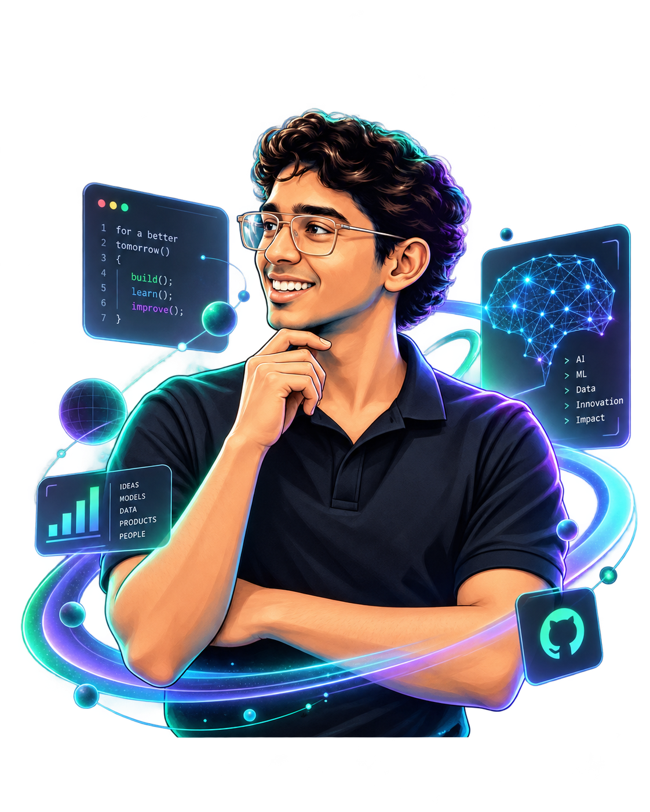

<!-- ========================================================= -->
<!--                 JASIR J — GITHUB PROFILE                  -->
<!-- ========================================================= -->

<div align="center">



<br><br>


<br><br>


<br><br>


<br><br>

<a href="https://www.linkedin.com/in/jasir-abdul-hameed-762388338">
  
</a>
<a href="https://huggingface.co/jasirjru">
  
</a>
<a href="https://github.com/jasirjru">
  
</a>
<a href="mailto:jrunull@gmail.com">
  
</a>

</div>

---

##  About Me

```txt
AI / ML Engineer
LLM-focused builder
Full-stack developer
CSE background

I build projects at the intersection of AI/ML, LLMs, web applications, and interactive systems.
My current focus is on creating:

intelligent AI/ML applications
LLM-powered tools and workflows
scalable backend systems
modern web experiences
Unreal / 3D interactive development
 Current Focus
AI / ML Engineering
LLM Apps & Fine-Tuning
Full-Stack Development
FastAPI / Node.js APIs
Interactive 3D / Unreal Workflows
Production-ready project building
 Tech Stack & Arsenal
<div align="center">
AI / ML / LLM
 <br>    

<br><br>

Backend / APIs
 <br> 

<br><br>

Frontend / Web


<br><br>

Databases / Cloud / Tools


<br><br>

Game / Systems / Engineering
 </div>
 Core Strengths
<div align="center">
Area	What I Build
AI / ML	ML models, intelligent systems, applied AI workflows
LLM	fine-tuning ideas, LLM pipelines, domain-focused AI tools
Backend	APIs, logic layers, data-driven systems
Frontend	modern, clean, responsive UI experiences
Full Stack	end-to-end application development
Engineering	production thinking, system building, iteration
</div>
 Featured Project Universe
<div align="center"> <table> <tr> <td width="50%" valign="top">
🧠 NEXUS

Intelligent AI system / advanced project build

AI-focused architecture
system design + product thinking
scalable direction for future evolution
<a href="https://github.com/jasirjru/NEXUS">  </a> </td> <td width="50%" valign="top">
🎯 DomainTune

Domain-adapted AI / ML system

domain-focused model work
LLM / fine-tuning direction
practical AI engineering workflow
<a href="https://github.com/jasirjru/DomainTune-Qwen2.5-1.5B-Triage">  </a> </td> </tr> <tr> <td width="50%" valign="top">
📊 CustomerIQ

Predictive customer analytics

customer insight workflows
data-driven thinking
ML + analytics direction
<a href="https://github.com/jasirjru/CustomerIQ">  </a> </td> <td width="50%" valign="top">
🥤 drink_3d

3D web experience / interactive visual build

creative frontend experiment
3D visual presentation
interactive design style
<a href="https://github.com/jasirjru/drink_3d">  </a> <a href="https://jasirjru.github.io/drink_3d/">  </a> </td> </tr> </table> </div>
 Private Development
🎮 Trench-Hauler

Private project — active development

Unreal Engine
C++
systems & gameplay engineering
iterative game development
Status: Private / In Development
Focus: Gameplay systems, AI, interaction, vehicle mechanics
 GitHub Analytics
<div align="center">  

<br><br>

 </div>
 Contribution Activity
<div align="center">  </div>
 Contribution Snake
<div align="center">  </div>

If the snake does not appear immediately, wait a few minutes after pushing or enable GitHub Actions.

 Engineering Identity
<div align="center">
Primary Identity:
AI / ML Engineer

Secondary Strengths:
LLM Systems
Full-Stack Development
Backend Engineering
Frontend UI Development
Interactive 3D / Unreal Exploration
</div>
 Connect With Me
<div align="center"> <a href="mailto:jrunull@gmail.com">  </a> <a href="https://www.linkedin.com/in/jasir-abdul-hameed-762388338">  </a> <a href="https://huggingface.co/jasirjru">  </a> <a href="https://github.com/jasirjru">  </a> </div>
<div align="center">
⚡ Building the future with AI, ML, LLMs, Web, and Engineering
 </div> ```
