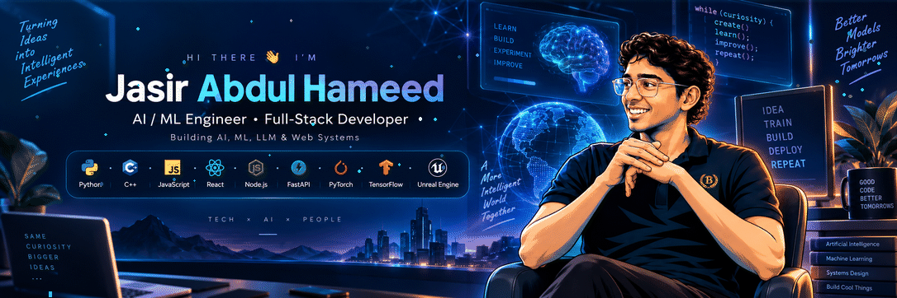
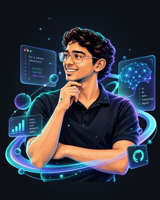

<!-- ======================================================= -->
<!--          JASIR ABDUL HAMEED — GITHUB PROFILE            -->
<!--             AI / ML ENGINEER • FULL-STACK               -->
<!-- ======================================================= -->

<div align="center">

<!-- 1. WIDE ANIMATED HERO BANNER -->


<br>

<!-- 2. ANIMATED TYPING SVG -->


<br>

<!-- 3. COMPACT IDENTITY & STATUS BADGES -->


<br>

<!-- 4. SOCIAL CONNECTIONS -->
<a href="https://www.linkedin.com/in/jasir-abdul-hameed-762388338">

</a>
<a href="https://huggingface.co/jasirjru">

</a>
<a href="mailto:jrunull@gmail.com">

</a>

</div>

<br>

<!-- ======================================================= -->
<!--             IDENTITY / TELEMETRY CARD                   -->
<!-- ======================================================= -->

<table>
<tr>
<td width="26%" align="center" valign="middle">

</td>
<td width="74%" valign="middle">

### `> SYSTEM.IDENTITY`

```text
NAME        : Jasir Abdul Hameed
ROLE        : AI / ML Engineer
FIELD       : Computer Science Engineering
PRIMARY     : AI • ML • LLM Engineering
SECONDARY   : Full-Stack Development
EXPLORING   : Unreal Engine • Interactive Systems
STATUS      : Building
```

Engineering applied machine learning systems, domain-adapted LLMs, and high-performance full-stack web applications. Focused on translating computational models into reliable, interactive software.

</td>
</tr>
</table>

---

<!-- ======================================================= -->
<!--                  CORE TECHNOLOGY                        -->
<!-- ======================================================= -->

## `> CORE.TECHNOLOGY`

<div align="center">

### AI / MACHINE LEARNING


<br>


<br><br>

### FULL-STACK DEVELOPMENT


<br><br>

### DATABASE & STORAGE


<br><br>

### ENGINEERING & SYSTEMS


</div>

---

<!-- ======================================================= -->
<!--                 ENGINEERING FOCUS                       -->
<!-- ======================================================= -->

## `> ENGINEERING.FOCUS`

<table>
<tr>
<td width="50%" valign="top">

### 🧠 AI / ML
- Machine-learning systems
- Model experimentation
- Data pipelines
- Evaluation workflows
- Applied AI architecture

</td>
<td width="50%" valign="top">

### 🤖 LLM ENGINEERING
- LLM applications
- LoRA / QLoRA fine-tuning
- Domain adaptation
- RAG systems
- Model evaluation

</td>
</tr>
<tr>
<td width="50%" valign="top">

### 🌐 WEB ENGINEERING
- React interfaces
- Node.js & Express backends
- FastAPI microservices
- REST APIs
- Modern frontend experiences

</td>
<td width="50%" valign="top">

### ⚙️ SYSTEMS
- C++ development
- Docker workflows
- Git / GitHub automation
- Unreal Engine
- Interactive systems

</td>
</tr>
</table>

---

<!-- ======================================================= -->
<!--                 FEATURED PROJECTS                       -->
<!-- ======================================================= -->

## `> FEATURED.PROJECTS`

<table>
<tr>
<td width="50%" valign="top">

### 🧠 NEXUS
Intelligent AI-driven architecture and autonomous system workflows engineered for scalable execution.

`AI Architecture` • `System Design` • `Intelligent Workflows` • `Python`

<br>

<a href="https://github.com/jasirjru/NEXUS">

</a>

</td>
<td width="50%" valign="top">

### 🎯 DomainTune
Domain-focused LLM fine-tuning and adaptation pipeline implementing parameter-efficient training (LoRA/QLoRA) and structured evaluation.

`LLM Fine-Tuning` • `LoRA / QLoRA` • `Domain Adaptation` • `Evaluation`

<br>

<a href="https://github.com/jasirjru/DomainTune-Qwen2.5-1.5B-Triage">

</a>
<a href="https://huggingface.co/jasirjru">

</a>

</td>
</tr>
<tr>
<td width="50%" valign="top">

### 📊 CustomerIQ
Machine learning customer intelligence pipeline for churn prediction, behavioral analytics, and automated decision metrics.

`Customer Analytics` • `Machine Learning` • `Predictive Modeling` • `Data Pipelines`

<br>

<a href="https://github.com/jasirjru/CustomerIQ">

</a>

</td>
<td width="50%" valign="top">

### 🥤 drink_3d
Interactive 3D web experience with modern fluid shaders, physics-inspired motion, and dynamic responsive interaction.

`3D Web` • `Interactive UI` • `WebGL / Canvas` • `Frontend Motion`

<br>

<a href="https://jasirjru.github.io/drink_3d/">

</a>
<a href="https://github.com/jasirjru/drink_3d">

</a>

</td>
</tr>
</table>

---

<!-- ======================================================= -->
<!--                 GITHUB ANALYTICS                        -->
<!-- ======================================================= -->

## `> GITHUB.ANALYTICS`

<div align="center">


<br>


<br>


</div>

---

<!-- ======================================================= -->
<!--               CONTRIBUTION ACTIVITY                     -->
<!-- ======================================================= -->

## `> CONTRIBUTION.SNAKE`

<div align="center">


</div>

---

<!-- ======================================================= -->
<!--                     CONTACT                             -->
<!-- ======================================================= -->

## `> CONNECT`

<div align="center">

### Jasir Abdul Hameed
**AI / ML Engineer • Full-Stack Developer**  
*Building AI • ML • LLM • Web Systems*

<br>

<a href="https://github.com/jasirjru">

</a>
<a href="https://www.linkedin.com/in/jasir-abdul-hameed-762388338">

</a>
<a href="https://huggingface.co/jasirjru">

</a>
<a href="mailto:jrunull@gmail.com">

</a>

<br><br>


<br>


</div>