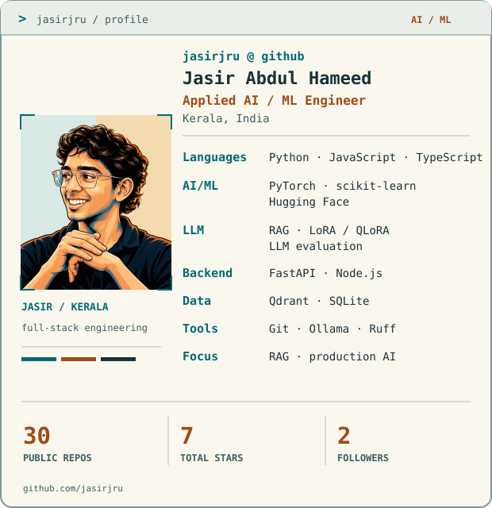
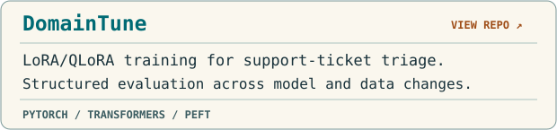
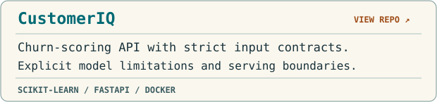
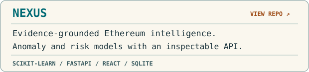

<picture>
  <source media="(prefers-color-scheme: dark)" srcset="./dark_mode.svg">
  
</picture>

<picture>
  <source media="(prefers-color-scheme: dark)" srcset="./assets/profile/focus_dark.svg">
  
</picture>

<a href="https://www.jruva.in/"><picture><source media="(prefers-color-scheme: dark)" srcset="./assets/profile/link_jruva_dark.svg"></picture></a>

### Featured AI/ML work

<a href="https://github.com/jasirjru/DomainTune"><picture><source media="(prefers-color-scheme: dark)" srcset="./assets/profile/domaintune_dark.svg"></picture></a>

<a href="https://huggingface.co/jasirjru/DomainTune-Qwen2.5-1.5B-Triage"><picture><source media="(prefers-color-scheme: dark)" srcset="./assets/profile/link_model_dark.svg"></picture></a>

<a href="https://github.com/jasirjru/CustomerIQ"><picture><source media="(prefers-color-scheme: dark)" srcset="./assets/profile/customeriq_dark.svg"></picture></a>

<a href="https://github.com/jasirjru/NEXUS"><picture><source media="(prefers-color-scheme: dark)" srcset="./assets/profile/nexus_dark.svg"></picture></a>

<picture>
  <source media="(prefers-color-scheme: dark)" srcset="./assets/profile/stack_dark.svg">
  
</picture>

<picture>
  <source media="(prefers-color-scheme: dark)" srcset="./assets/profile/activity_dark.svg">
  
</picture>

  <a href="https://github.com/jasirjru?tab=repositories"><picture><source media="(prefers-color-scheme: dark)" srcset="./assets/profile/link_repositories_dark.svg"></picture></a>
  <a href="https://github.com/jasirjru?tab=overview"><picture><source media="(prefers-color-scheme: dark)" srcset="./assets/profile/link_contributions_dark.svg"></picture></a>

### Contribution snake

<picture>
  <source media="(prefers-color-scheme: dark)" srcset="https://raw.githubusercontent.com/jasirjru/jasirjru/gh-pages/github-contribution-grid-snake-dark.svg">
  
</picture>

### Connect

  <a href="https://github.com/jasirjru"><picture><source media="(prefers-color-scheme: dark)" srcset="./assets/profile/connect_github_dark.svg"></picture></a>
  <a href="https://www.linkedin.com/in/jasir-abdul-hameed-762388338/"><picture><source media="(prefers-color-scheme: dark)" srcset="./assets/profile/connect_linkedin_dark.svg"></picture></a>
  <a href="https://huggingface.co/jasirjru"><picture><source media="(prefers-color-scheme: dark)" srcset="./assets/profile/connect_hugging_face_dark.svg"></picture></a>
  <a href="mailto:jrunull@gmail.com"><picture><source media="(prefers-color-scheme: dark)" srcset="./assets/profile/connect_email_dark.svg"></picture></a>

