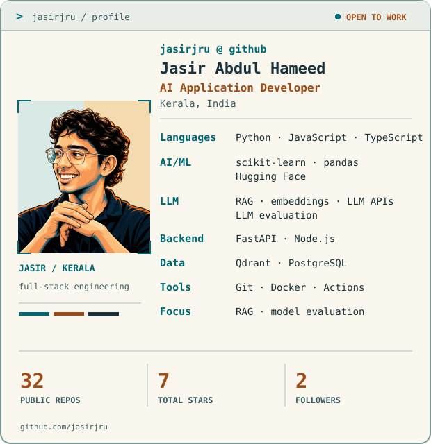
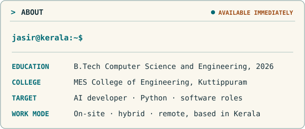
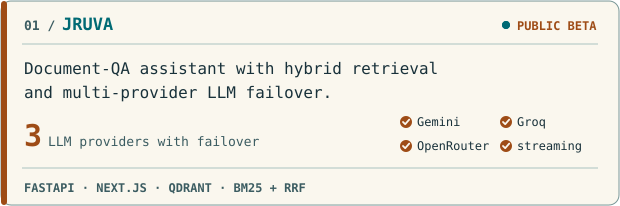
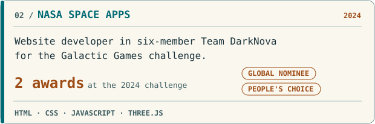
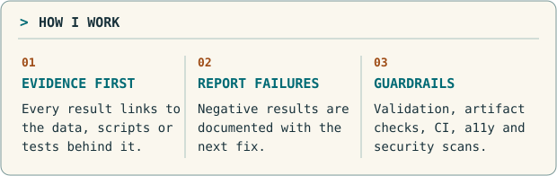
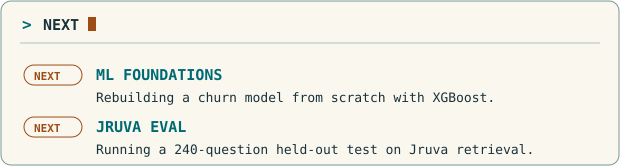
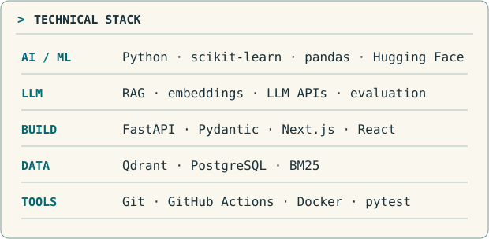

<picture>
  <source media="(prefers-color-scheme: dark)" srcset="./dark_mode.svg">
  
</picture>

<picture>
  <source media="(prefers-color-scheme: dark)" srcset="./assets/profile/about_dark.svg">
  
</picture>

<a href="https://jasirjru-portfolio.vercel.app"><picture><source media="(prefers-color-scheme: dark)" srcset="./assets/profile/btn_portfolio_dark.svg"></picture></a>
<a href="https://jasirjru-portfolio.vercel.app/resume.pdf"><picture><source media="(prefers-color-scheme: dark)" srcset="./assets/profile/btn_resume_dark.svg"></picture></a>
<a href="https://www.linkedin.com/in/jasirjru"><picture><source media="(prefers-color-scheme: dark)" srcset="./assets/profile/btn_linkedin_dark.svg"></picture></a>
<a href="https://huggingface.co/jasirjru"><picture><source media="(prefers-color-scheme: dark)" srcset="./assets/profile/btn_hugging_face_dark.svg"></picture></a>
<a href="mailto:jasirlvl@gmail.com"><picture><source media="(prefers-color-scheme: dark)" srcset="./assets/profile/btn_email_dark.svg"></picture></a>

### Featured work

<a href="https://www.jruva.in"><picture>
  <source media="(prefers-color-scheme: dark)" srcset="./assets/profile/work_jruva_dark.svg">
  
</picture></a>

[Live beta](https://www.jruva.in) · [Benchmark, data and script](https://github.com/jasirjru/jruva-retrieval-eval) · application source private, walkthrough on request

<a href="https://www.spaceappschallenge.org/2024/find-a-team/darknova/"><picture>
  <source media="(prefers-color-scheme: dark)" srcset="./assets/profile/work_nasa_dark.svg">
  
</picture></a>

[Official team page](https://www.spaceappschallenge.org/2024/find-a-team/darknova/) · [Website source](https://github.com/jasirjru/dark_nova)

 

<picture>
  <source media="(prefers-color-scheme: dark)" srcset="./assets/profile/principles_dark.svg">
  
</picture>

<picture>
  <source media="(prefers-color-scheme: dark)" srcset="./assets/profile/roadmap_dark.svg">
  
</picture>

<picture>
  <source media="(prefers-color-scheme: dark)" srcset="./assets/profile/stack_dark.svg">
  
</picture>

### Contributions

<picture>
  <source media="(prefers-color-scheme: dark)" srcset="https://raw.githubusercontent.com/jasirjru/jasirjru/gh-pages/github-contribution-grid-snake-dark.svg">
  
</picture>

Cards and animations are generated by <a href="generate_profile.py">generate_profile.py</a> (daily) and Platane/snk (every 12 hours) with GitHub Actions. Motion is disabled when your system prefers reduced motion.
